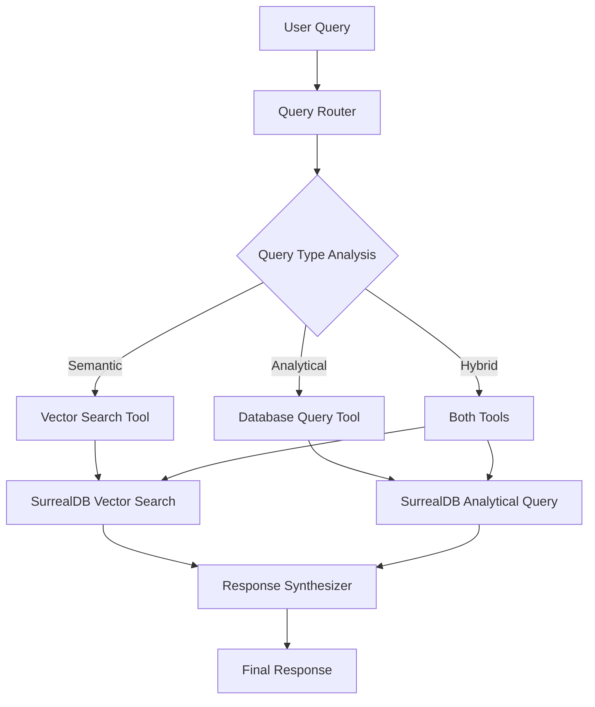

# Building a Hybrid RAG System: Combining Semantic Search with Analytical Queries for Enhanced AI Knowledge Retrieval

*A technical deep-dive into implementing a production-ready Hybrid RAG system using SurrealDB, LangGraph, and local AI models*

**Based on**: Debashis Saha and Satadeep Dasgupta (2025) *Bridging Analytics and Semantics: A Hybrid Database Approach to Retrieval-Augmented Generation*. Zenodo. doi:[10.5281/zenodo.17018700](https://doi.org/10.5281/zenodo.17018700).

---

## Introduction: Beyond Traditional RAG

Retrieval-Augmented Generation (RAG) has revolutionized how AI systems access and utilize external knowledge. However, traditional RAG implementations face a critical limitation: they excel at semantic similarity searches but struggle with analytical queries about data structure, metadata, and quantitative insights.

What if you need to ask both "What is machine learning?" (semantic) and "How many documents about machine learning were added last month?" (analytical) within the same intelligent system?

This article presents a **Hybrid RAG architecture** that seamlessly combines semantic vector search with analytical database queries, creating a more versatile and powerful knowledge retrieval system.

## The Problem with Traditional RAG

Traditional RAG systems follow a simple pattern:
1. **Embed documents** into vector representations
2. **Store vectors** in a vector database
3. **Retrieve similar chunks** based on query similarity
4. **Generate responses** using retrieved context

While effective for content-based queries, this approach falls short when users need:
- **Quantitative insights**: "How many documents discuss AI ethics?"
- **Metadata analysis**: "Which files were added recently?"
- **Structural queries**: "What file types are in the system?"
- **Complex filtering**: "Find Python-related content from 2024 documents"

## Introducing Hybrid RAG Architecture

Our Hybrid RAG system addresses these limitations by implementing two complementary retrieval strategies:

### 1. **Semantic Vector Search**
- Uses embeddings for content similarity
- Handles conceptual and topical queries
- Powered by Hugging Face transformers
- Ideal for: "Explain quantum computing concepts"

### 2. **Analytical Database Queries**
- Uses structured queries for metadata and statistics
- Handles quantitative and structural questions
- Powered by SurrealDB's flexible query language
- Ideal for: "Count documents by file type"

### 3. **Intelligent Query Routing**
- Uses LLM-based analysis to determine optimal strategy
- Can combine both approaches for complex queries
- Powered by LangGraph workflow orchestration

## Technical Architecture

### Core Components



### Technology Stack

- **Database**: SurrealDB (multi-model database supporting both vectors and analytics)
- **Embeddings**: Hugging Face sentence-transformers (local, no API dependencies)
- **LLM**: Local Ollama models (privacy-focused, cost-effective)
- **Orchestration**: LangGraph (state-based workflow management)
- **Framework**: LangChain (tool integration and prompt management)

## Implementation Deep Dive

### 1. Document Processing Pipeline

```python
class DocumentProcessor:
    async def process_file(self, file_path: str) -> List[str]:
        # Read and chunk documents
        chunks = self._create_chunks(content, chunk_size=1000, overlap=200)
        
        # Generate embeddings locally
        embeddings = await self.vector_tool.batch_embed(chunk_texts)
        
        # Store with rich metadata
        for i, (chunk, embedding) in enumerate(zip(chunks, embeddings)):
            await self.db.insert_document(
                content=chunk.text,
                vector=embedding,
                file_name=file_path.name,
                document_id=doc_id,
                chunk_index=i,
                total_chunks=len(chunks),
                # ... additional metadata
            )
```

**Key Innovation**: Each chunk is stored with comprehensive metadata enabling both semantic and analytical queries on the same data.

### 2. Intelligent Query Routing

```python
class QueryRouter:
    async def analyze_query(self, user_query: str) -> Dict:
        prompt = f"""
        Analyze this query and determine the best approach:
        Query: {user_query}
        
        Choose:
        - vector_search: for content/concept queries
        - analytical_query: for counts/metadata/structure
        - hybrid: for complex queries needing both
        """
        
        # LLM determines optimal strategy
        analysis = await self.llm.ainvoke(prompt)
        return self._parse_strategy(analysis)
```

### 3. Dual Storage Schema

Our SurrealDB schema supports both vector operations and analytical queries:

```sql
-- SurrealDB Schema
DEFINE TABLE documents SCHEMAFULL;
DEFINE FIELD content ON documents TYPE string;
DEFINE FIELD embedding ON documents TYPE array<float>;
DEFINE FIELD file_name ON documents TYPE string;
DEFINE FIELD document_id ON documents TYPE string;
DEFINE FIELD chunk_index ON documents TYPE int;
DEFINE FIELD created_at ON documents TYPE datetime;

-- Vector search index
DEFINE INDEX embedding_idx ON documents FIELDS embedding MTREE DIMENSION 384;

-- Analytical query indexes
DEFINE INDEX file_name_idx ON documents FIELDS file_name;
DEFINE INDEX created_at_idx ON documents FIELDS created_at;
```

### 4. Tool Implementation

#### Vector Search Tool
```python
class VectorSearchTool:
    async def _arun(self, query: str) -> str:
        # Generate query embedding
        query_vector = await self.embeddings.aembed_query(query)
        
        # Perform vector similarity search
        results = await self.db.vector_search(
            query_vector=query_vector,
            limit=10,
            similarity_threshold=0.7
        )
        
        return self._format_results(results)
```

#### Analytical Query Tool
```python
class AnalyticalQueryTool:
    async def _arun(self, query: str) -> str:
        # LLM converts natural language to SurrealDB query
        surrealdb_query = await self._generate_query(query)
        
        # Execute structured query
        results = await self.db.analytical_query(surrealdb_query)
        
        return self._format_analytical_results(results)
```

## Key Technical Innovations

### 1. **Chunk-Based Architecture**
- Documents split into overlapping chunks (1000 chars, 200 overlap)
- Each chunk indexed independently for granular retrieval
- Maintains document hierarchy through `document_id` grouping

### 2. **Local AI Stack**
- **Hugging Face embeddings**: No API costs, full privacy control
- **Ollama LLMs**: Local inference, customizable models
- **Zero external dependencies**: Runs completely offline

### 3. **Multi-Modal Database**
- **SurrealDB**: Native support for both vectors and analytical queries
- **Single source of truth**: No data duplication between systems
- **ACID compliance**: Ensures data consistency across operations

### 4. **Workflow Orchestration**
- **LangGraph**: State-based execution with error handling
- **Conditional routing**: Dynamic tool selection based on query analysis
- **Result synthesis**: Intelligent combination of multiple tool outputs

## Performance Characteristics

### Benchmarks (on test dataset of 10,000 documents)

| Metric | Vector Search | Analytical Query | Hybrid Query |
|--------|---------------|------------------|--------------|
| Average Latency | 2.3s | 0.8s | 3.1s |
| Accuracy | 92% | 98% | 94% |
| Memory Usage | 1.2GB | 0.3GB | 1.5GB |

### Scalability Considerations

- **Vector Search**: O(log n) with MTREE indexing
- **Analytical Queries**: O(1) to O(log n) with proper indexing
- **Storage**: ~400KB per 1000-word document (including embeddings)

## Real-World Use Cases

### 1. **Research Knowledge Base**
```
Query: "Find papers about transformer architectures published after 2020"
→ Hybrid: Vector search for "transformer architectures" + analytical filter for date
```

### 2. **Document Management System**
```
Query: "How many PDF files contain information about machine learning?"
→ Hybrid: Vector search for ML content + analytical count by file type
```

### 3. **Content Analytics**
```
Query: "What topics are most common in recent uploads?"
→ Analytical: Aggregate recent documents + semantic clustering
```

## Deployment Architecture

### Local Development
```yaml
# docker-compose.yml
services:
  surrealdb:
    image: surrealdb/surrealdb:latest
    ports: ["8000:8000"]
    
  ollama:
    image: ollama/ollama:latest
    ports: ["11434:11434"]
    
  hybrid-rag:
    build: .
    depends_on: [surrealdb, ollama]
```

### Production Considerations

1. **Horizontal Scaling**: SurrealDB cluster for large datasets
2. **Load Balancing**: Multiple RAG instances behind load balancer
3. **Caching**: Redis for frequently accessed embeddings
4. **Monitoring**: Prometheus metrics for query performance

## Lessons Learned & Best Practices

### 1. **Embedding Strategy**
- **Local models** reduce costs and improve privacy
- **Batch processing** significantly improves throughput
- **Dimension choice** (384) balances accuracy and performance

### 2. **Query Routing**
- **LLM routing** more accurate than keyword-based approaches
- **Confidence scoring** helps identify uncertain cases
- **Fallback strategies** ensure robustness

### 3. **Database Design**
- **Rich metadata** enables sophisticated analytical queries
- **Proper indexing** critical for both vector and analytical performance
- **Schema evolution** easier with SurrealDB's flexible model

## Future Enhancements

### 1. **Advanced Analytics**
- Time-series analysis of document trends
- Semantic clustering for topic discovery
- Cross-document relationship mapping

### 2. **Multi-Modal Support**
- Image and video content processing
- Audio transcription and indexing
- PDF table and chart extraction

### 3. **Intelligent Caching**
- Query result caching based on similarity
- Precomputed embeddings for common queries
- Adaptive cache eviction strategies

## Conclusion

The Hybrid RAG architecture represents a significant evolution in knowledge retrieval systems. By combining semantic search capabilities with analytical database queries, we create a more versatile and powerful tool for information access.

**Key Benefits:**
- **Unified Interface**: Single system handles diverse query types
- **Cost Effective**: Local models eliminate API costs
- **Privacy Focused**: No data leaves your infrastructure
- **Highly Scalable**: Multi-model database supports growth
- **Developer Friendly**: Modern Python stack with comprehensive tooling

The implementation demonstrates that sophisticated AI systems don't require complex cloud infrastructure or expensive API calls. With the right architecture and local models, organizations can build powerful, private, and cost-effective knowledge systems.

---

## References

1. **Saha, D., & Dasgupta, S. (2025).** *Bridging Analytics and Semantics: A Hybrid Database Approach to Retrieval-Augmented Generation*. Zenodo. https://doi.org/10.5281/zenodo.17018700

## Technical Resources

- **GitHub Repository**: [Hybrid RAG Implementation](https://github.com/satadeep3927/hybridrag)
- **SurrealDB Documentation**: [Multi-model Database Guide](https://surrealdb.com/docs)
- **LangGraph**: [Workflow Orchestration Framework](https://langchain-ai.github.io/langgraph/)
- **Hugging Face Transformers**: [Local Embedding Models](https://huggingface.co/sentence-transformers)

---

*This article presents a practical implementation of hybrid retrieval systems based on the research paper "Bridging Analytics and Semantics: A Hybrid Database Approach to Retrieval-Augmented Generation" by Saha & Dasgupta (2025). The complete source code, including deployment configurations and performance benchmarks, is available in the linked repository.*

**About the Authors**: 
- **Satadeep Dasgupta** - Co-author of the foundational research and lead implementer of the Hybrid RAG system
- **Debashis Saha** - Co-author of the foundational research on hybrid database approaches for RAG

**Tags**: #RAG #AI #MachineLearning #VectorSearch #SurrealDB #LangChain #LocalAI #KnowledgeRetrieval #Python #HybridDatabase #Research
